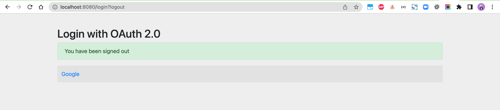
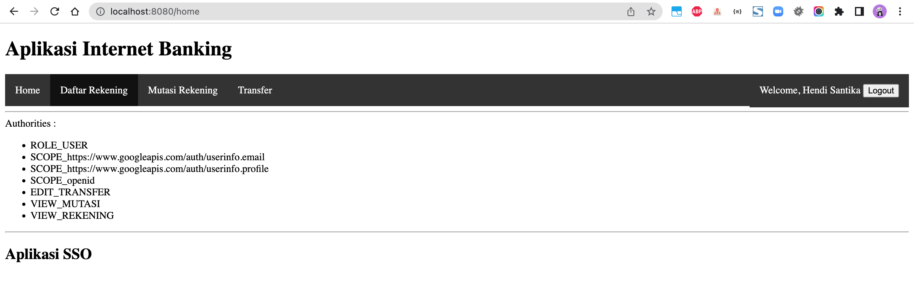

# spring-boot-google-sso

### Things todo list

1. Clone this repository: `git clone https://github.com/hendisantika/spring-boot-google-sso.git`
2. Navigate to the folder: `cd spring-boot-google-sso`
3. Replace MySQL credentials with your own.
4. Replace Google credentials with your own.
5. Run the application: `mvn clean spring-boot:run`
6. Open your favorite browser: http://localhost:8080

### Image Screen shot

Login Page

Home Page

